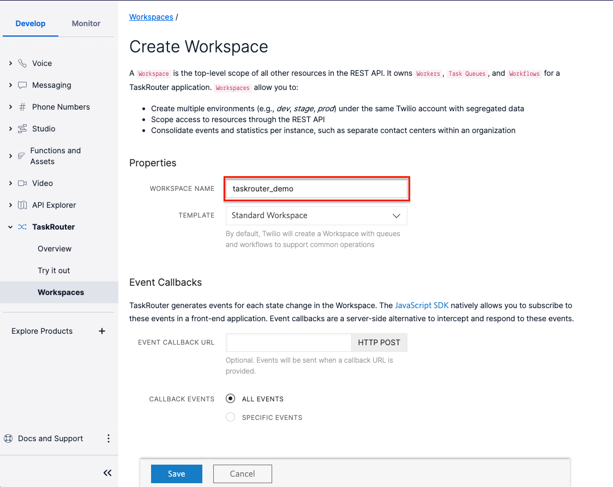
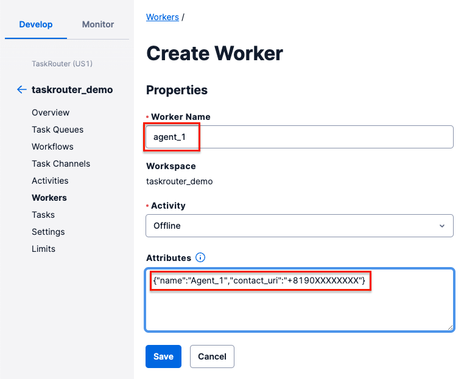
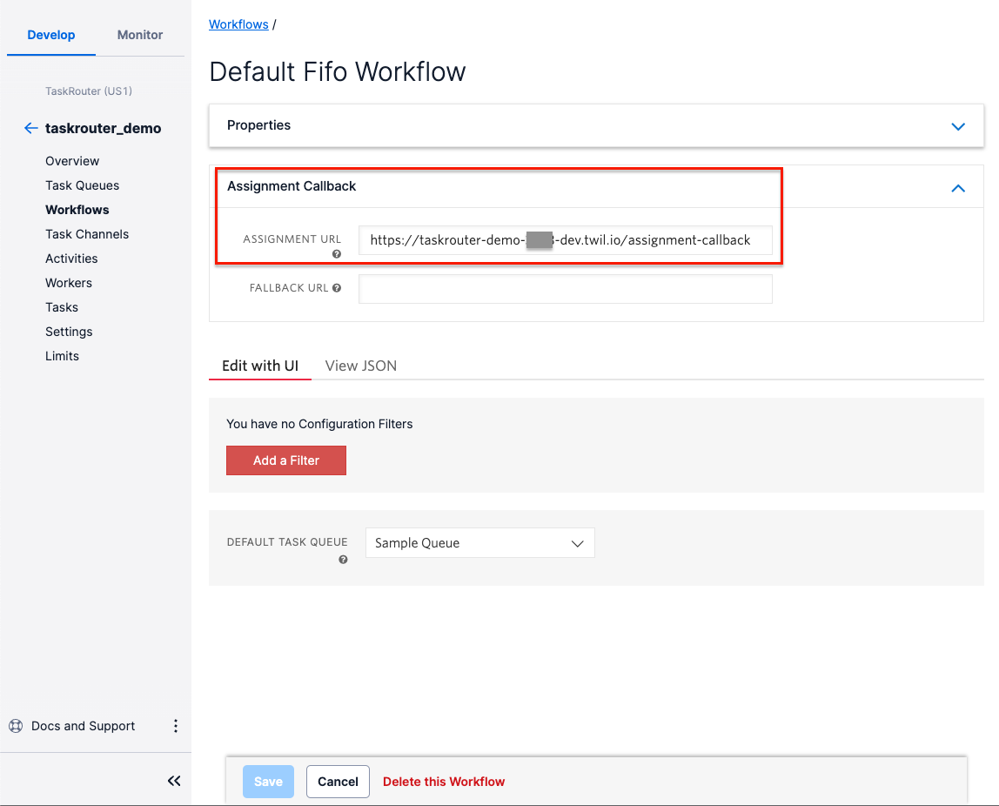
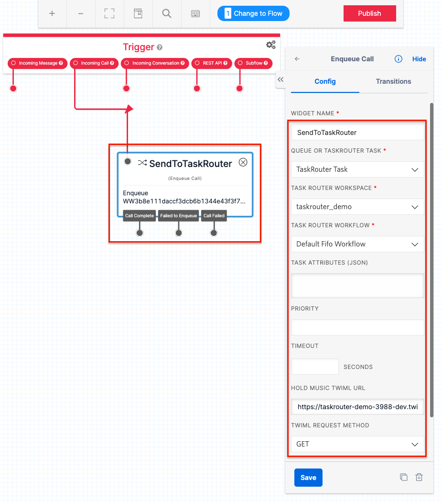
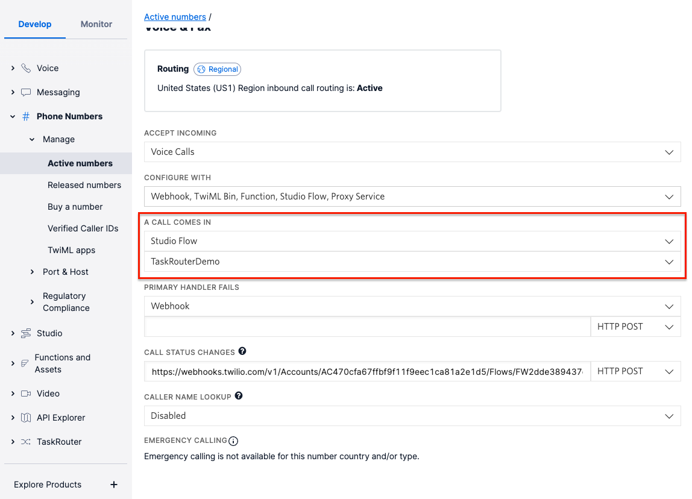

# TaskRouter デモ

タスクルーターを使って、着信したコールを複数の PSTN 宛に転送します。  
この手順では単純な転送のみを想定していますので、ワークフローの設計などは含まれません。

## シナリオ

Twilio で購入した番号に着信したコールを、予め設定しておいた複数の電話番号に転送します。
ワークフローは初期状態で作成しますので、単純にラウンドロビン（待ち時間の長い転送先を順番にアサイン）で転送されます。

## 準備

本手順を実施するためには、以下の項目を予め用意しておく必要があります。

- 転送先となる電話番号
- Twilio アカウント（アカウントをお持ちでない方は、[こちら](https://cloudapi.kddi-web.com/signup)から作成してください。
- Twilio の API Key / API Secret
- 転送元に使う電話番号の購入（日本の番号を購入するには、Bundles の作成も必要です）
- Twilio CLI のセットアップ
- CLI Serverless プラグインのセットアップ

## タスクルーターの初期設定

- 管理コンソールにログインし、TaskRouter > Workspaces メニューに移動します。
- **Create new Workspace**ボタンを押して新しいワークスペースを作成します。
  
- **WORKSPACE NAME**欄に何か名前をつけて、**Save**ボタンを押します。
- 作成されたワークスペースの SID（WS から始まる文字列）は後ほど作成しますので、どこかに控えておいてください。

## ワーカーを作成する

ワーカーとは、タスクルーターにおけるオペレーターになります。今回は電話を転送するために転送先番号ごとにワーカーを作成していきます。

- 先ほど作成したワークスペースの Workers を選択します。
- **Create new Worker**ボタンを押します。
  
- **Worker Name**欄に、何かわかり易い名前をつけます。
- **Attributes**欄に、以下の JSON を記述します。

```json
{ "name": "Agent_1", "contact_uri": "+8190XXXXXXXX" }
```

- ※contact_uri には、転送させたい先の電話番号を記載してください（E.164 形式）。
- **Save**ボタンを押して、ワーカーを作成します。
- 転送先を複数設定する場合は、上記を繰り返して複数のワーカーを作成してください。

## Functions / Assets のデプロイ

ではここからは、転送に必要なプログラムなどを Twilio にデプロイしていきましょう。

### .env

`.env.sample`をコピーします。

```bash
cp .env.sample .env
```

コピーした`.env`を編集します。

| 設定項目      | 値                                                      |
| :------------ | :------------------------------------------------------ |
| ACCOUNT_SID   | Twilio の AccountSid（AC から始まる文字列）             |
| API_KEY       | Twilio の API Key（SK から始まる文字列）                |
| API_SECRET    | API Key とペアで作成される API Secret                   |
| WORKSPACE_SID | 先程作成したワークスペースの SID（WS から始まる文字列） |
| TRANSFER_FROM | Twilio 上で購入した電話番号（E.164 形式）               |

### デプロイ

以下のコマンドを使って、Functions などを Twilio にデプロイしていきます。

```bash
npm run deploy
```

デプロイが成功すると、`Domain（taskrouter-demo-XXXX-dev.twil.io）`が払い出されますので、メモ帳などに控えておいてください。

## Assignment Callback の設定

タスクルーターがワーカーを選択すると、タスクがワーカーに割り当てられます。その際に Twilio から Webhook が飛んでくるので、それを処理することで転送を実現します。

この Webhook のことを、`Assignment Callback` と呼び、設定はワークフロー設定で行います。

- ワークスペース内の Workflows を選択します。
- すでに作成されている`Default Fifo Workflow`を選択します。
  
- **Assignment Callback**を展開し、**ASSIGNMENT URL**欄に、`https://taskrouter-demo-XXXX-dev.twil.io/assignment-callback`（XXXX は先程デプロイしたときに払い出された Domain 環境に合わせてください）
- **Save**ボタンを押して設定を保存します。

ちなみに、Webhook 先となる`assignment-callback`は以下のようなコードになっています。

```javascript
exports.handler = function (context, event, callback) {
  console.log(`🐞 assignment-callback called.`);
  const { DOMAIN_NAME, TRANSFER_FROM } = context;
  let res = {
    instruction: 'dequeue',
    from: TRANSFER_FROM,
    status_callback_url: `https://${DOMAIN_NAME}/status-callback`,
  };

  callback(null, res);
};
```

[こちら](https://www.twilio.com/docs/taskrouter/handle-assignment-callbacks)のドキュメントに記載があるように、Assignment Callback では色々な処理が用意されています。  
今回は、着信してキューに入っているコールを転送したいため、[dequeue](https://www.twilio.com/docs/taskrouter/handle-assignment-callbacks#dequeue-call)を使っていくことになります。

`instruction`パラメータに、`dequeue`を指定することで、キューに入っているコールを取り出し、更に電話を転送してくれます。  
転送先は、`to`パラメータで指定しても良いのですが、Workers の Attributes に`contact_uri`パラメータがある場合は、そちらがデフォルトで使われます。  
`from`パラメータは、日本国内で PSTN 経由の発信をする場合は必ず Twilio の番号を発信元番号に指定する必要があるので必須となります。  
`status_callback_url`パラメータについては、後ほど解説をします。

## 着信を TaskRouter に接続

最後に、着信したコールを TaskRouter にわたす部分を作成します。具体的には、`Enqueue`動詞を使って渡すことができますが、Studio フローでも実現が可能なため、今回は Studio フローを使っていきましょう。

- 管理コンソールから Studio を選択します。
- スクラッチで新しいフローを作成しましょう。名前は何でも OK です。
- **Enqueue Call**ウィジェットをキャンバスにドラッグし、**Incoming Call**とつなぎます。
- **Enqueue Call**ウィジェットには以下のようにパラメータを設定していきます。
  

| パラメータ               | 値                                                                                           |
| :----------------------- | :------------------------------------------------------------------------------------------- |
| WIDGET NAME              | なんでもよいです                                                                             |
| QUEUE OR TASKROUTER TASK | `TaskRouter Task`を選択                                                                      |
| TASK ROUTER WORKSPACE    | 今回作成したワークスペースを選択                                                             |
| TASK ROUTER WORKFLOW     | 先程 Webhook を設定した`Default Fifo Workflow`を選択                                         |
| HOLD MUSIC TWIML URL     | `https://taskrouter-demo-XXXX-dev.twil.io/wait-url`（XXXX はご自分の環境に合わせてください） |
| TWIML REQUEST METHOD     | `GET`を選択                                                                                  |

- **Save**ボタンを押して設定を保存した後、忘れずに**Publish**をしておいてください。

## 着信番号にフローを割り当て

では今作成した Studio フローを、着信番号に割り当てましょう。

- 管理コンソール内の Phone Numbers > Manage > Active numbers を選択し、着信させたい番号のプロパティを開きます。
  
- **A CALL COME IN**で`Studio Flow`と、先程作成したフローを選択します。

## 動作確認

上記の設定で、**HOLD MUSIC TWIML URL**を指定しているため、着信した際に「ただいま、オペレーターにお繋ぎしておりますので、このまましばらくお待ち下さい。」というガイダンスが流れ、電話が転送されます。  
何回かテストをして、ラウンドロビンで振り分けられていることを確認しておきましょう。

## 動作説明

では最後に、一連の流れの解説をしていきます。

1. 着信したコールは、Studio 経由で TaskRouter に渡ります。このときのワークフローは Enqueue ウィジェットで指定しています。
2. ワークフローの中では、本来はスキルルーティングなどが設定できますが、今回設定した`Default Fifo Workflow`は、直接`Sample Queue`にコールを入れています。また、キューに入れる順番も指定をしていませんので、最後の対応してからの時間がもっとも長い Worker からアサインされるようになります。
3. `Sample Queue`には、このキューで通話をアサインされる Worker が紐付けられますが、今回は特別な条件は指定されていないので、すべての Worker がアサイン対象となります。
4. ここでワーカーがアサインされると、`Reservation`が作成され、Worker は予約済みとなります。と同時に、ワークフローで設定した`Assignment Callback`が発火します。
5. Webhook の通知先である、`assignment-callback.js`では、単純にキューからコールを取り出して、転送先に転送することを目的とした`dequeue`応答を返します。これにより、Twilio はコールをキューから取り出して、転送先に発信します。
6. 通話中のときのタスクの状態（Assignment Status）は、`assigned`になり、この状態では Worker は他のコールを受けられませんし、タスクルーターもアサインはしません。
7. 通話が終了すると、タスクの状態は`wrapped`（後処理中）になります。後処理中のタスクを持っている Worker は、次のコールがアサインされないので、今回の例だと全員が一度通話をしてしまうと、後続の着信を誰も取らなくなってしまいます。
8. そこで、`dequeue`応答した際に、`status_callback_url`を指定し、通話が終了した時に、Twilio から Webhook を取得するようにしておきます。そして、Webhook の受取先（`status-callback.js`）でタスクの状態を強制的に`completed`に書き換える処理を入れています。具体的には以下のようなコードとなります。

```javascript
exports.handler = async function (context, event, callback) {
  console.log(`🐞 status-callback called.`);
  const { TaskSid, CallStatus, ReservationSid } = event;
  const { API_KEY, API_SECRET, ACCOUNT_SID, WORKSPACE_SID } = context;
  const client = require('twilio')(API_KEY, API_SECRET, {
    accountSid: ACCOUNT_SID,
  });
  try {
    if (CallStatus === 'completed') {
      // 通話が正常に終了したらタスクを完了させる
      await client.taskrouter.v1
        .workspaces(WORKSPACE_SID)
        .tasks(TaskSid)
        .update({
          assignmentStatus: 'completed',
        });
    } else {
      // 通話が失敗したら、Reservationをリジェクトする
      await client.taskrouter.v1
        .workspaces(WORKSPACE_SID)
        .tasks(TaskSid)
        .reservations(ReservationSid)
        .update({
          reservationStatus: 'rejected',
        });
    }
    callback(null, {});
  } catch (err) {
    console.error(`👺 ERROR: ${err.message ? err.message : err}`);
    callback(err);
  }
};
```

`Assignment Callback`から転送したときの`Status Callback`には、標準で`TaskId`が含まれています。なので、この値を使ってタスクを更新しています。

## イレギュラーな処理

もし転送先が応答しなかった場合など、正常に通話が終了しない場合は、別の Worker にアサインし直す必要があります。  
その場合は、`Status Callback`で、`CallStatus`を判定し、`completed`以外が入っている場合は、Reservation のステータスを`reject`に更新することで対応が可能です。
上記の`status-callback.js`にその処理が記載されています。

## まとめ

以上が、今回のデモの一連の流れとなります。  
タスクルーターは基本的にタスクをワーカーにアサインするところが主な役割になりますので、アサインされたあとの処理はプログラムで対応する必要があります。
